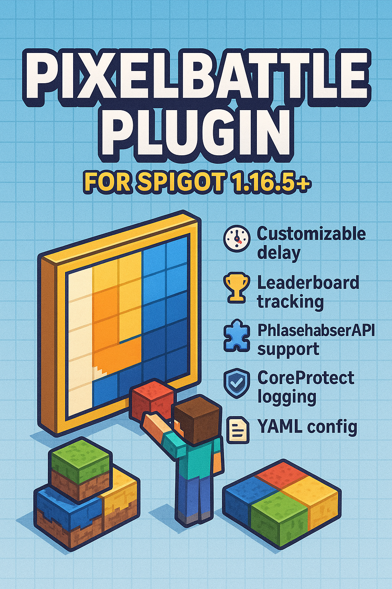

# 🎨 PixelBattle Plugin for Spigot 1.16.5+

> [🇷🇺 Читать на русском](./README_RU.MD)



PixelBattle is a Minecraft plugin that allows players to engage in pixel art battles using colored wool blocks. Blocks are placed with a customizable delay, and a leaderboard tracks activity. Fully supports PlaceholderAPI, with optional CoreProtect integration for rollback logging.

---

## 🚀 Features

- ⏱ Customizable delay between block placements
- 🏆 Leaderboard & statistics tracking
- 🧩 Full PlaceholderAPI support
- 🛡 Optional CoreProtect logging
- 🧱 Automatic inventory setup with colored wool
- 💾 Data persistence via YAML

---

## 📥 Installation

1. Download the `.jar` from [releases](https://github.com/YOUR-USERNAME/PixelBattlePlugin/releases)
2. Drop it into your server’s `/plugins` folder
3. Install [PlaceholderAPI](https://github.com/PlaceholderAPI/PlaceholderAPI)
4. (Optional) Install [CoreProtect](https://github.com/PlayPro/CoreProtect)
5. Restart your server

---

## 📜 Commands & Permissions

| Command         | Description                                | Permission     |
|-----------------|--------------------------------------------|----------------|
| `/setdelay <n>` | Set delay (seconds) between block placing  | `pb.setdelay`  |

---

## 🧩 Placeholders

Use these with PlaceholderAPI-compatible plugins:

| Placeholder               | Description                            |
|---------------------------|----------------------------------------|
| `%pixelbattle_delay%`     | Current placement delay                |
| `%pixelbattle_total%`     | Total blocks placed (global)           |
| `%pixelbattle_totalk%`    | Total blocks (in thousands)            |
| `%pixelbattle_count%`     | Player's block count                   |
| `%pixelbattle_{number}%`  | Top N player by block count            |

---

## 🧱 Config Example

```yaml
delay: 10
delay-message: "&cWait %d seconds!"
placed: "&aBlock placed!"
entry-format: "&f%s &7- &e%d"
not-a-number: "&cThat is not a number"
setdelay-error: "&cUsage: /setdelay <delay>"
setdelay-success: "&aDelay set successfully"
```
